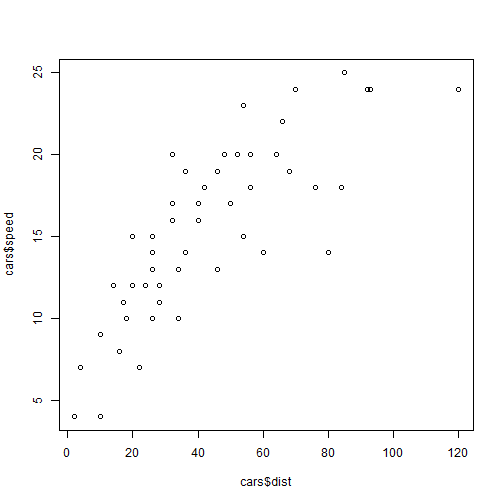
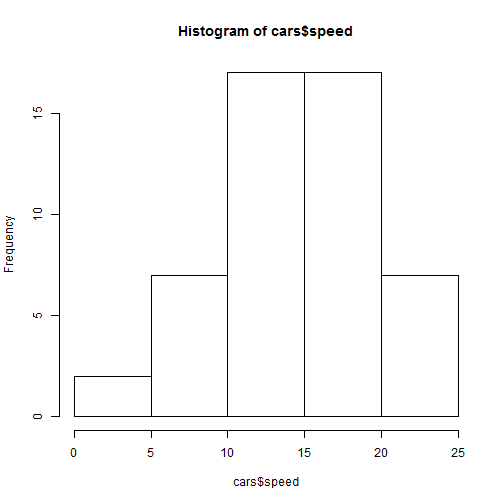

```r
require(rCharts)
```

## Read-And-Delete

1. Edit YAML front matter
2. Write using R Markdown
3. Use an empty line followed by three dashes to separate slides!

--- .class #id 

## Cars Distance vs. Speed Plot


```r
data(cars)
plot(cars$dist, cars$speed)
```



--- .class #id 

## Cars Data


```r
head(cars)
```

```
##   speed dist
## 1     4    2
## 2     4   10
## 3     7    4
## 4     7   22
## 5     8   16
## 6     9   10
```

--- .class #id 

## Cars Speed Histogram


```r
hist(cars$speed)
```



--- .class #id 

## rChart 1

<iframe src="n1.html" width=100%, height=600></iframe>

--- .class #id
